# The Architecture of GEMVC

> **Version:** 5.15.0 (philosophy document)
>
> This document defines the architectural philosophy behind GEMVC.
>
> It does not explain how to use the framework.
>
> It explains **why** the framework exists, **which assumptions it makes**, and **how every major architectural decision follows from those assumptions**.
>
> API documentation explains *how*.
>
> This document explains *why*.
>
> How-to / request flow: [`docs/guides/architecture.md`](docs/guides/architecture.md)

---

# Executive Summary

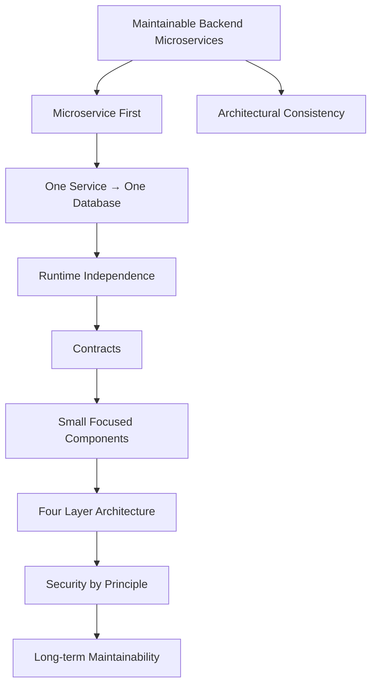

GEMVC is an opinionated backend framework.

It intentionally optimizes for a single architectural style:

- Backend Microservices
- One Service owns one Database
- Explicit Layer Separation
- Runtime Independence
- Security by Principle
- Small Focused Components

Rather than maximizing flexibility, GEMVC maximizes architectural consistency.

Every subsystem inside the framework exists because of these principles.

---

# Introduction

Every software framework begins with assumptions.

Some frameworks attempt to support every architectural style.

Others deliberately optimize for one.

GEMVC belongs to the second category.

It is an opinionated PHP framework designed exclusively for backend microservices.

Its architecture is built around carefully selected constraints rather than unlimited flexibility.

These constraints simplify software architecture by removing decisions that every project would otherwise need to make independently.

This document describes those architectural assumptions.

---

# The Architectural Vision

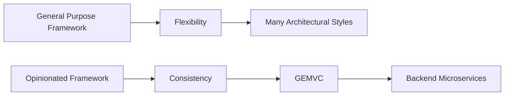

General-purpose frameworks maximize flexibility.

Opinionated frameworks maximize consistency.

Neither philosophy is universally correct.

GEMVC intentionally chooses consistency.

It is not designed to solve every backend problem.

It is designed to solve one problem exceptionally well:

> **Building maintainable backend microservices.**

---

# Core Philosophy

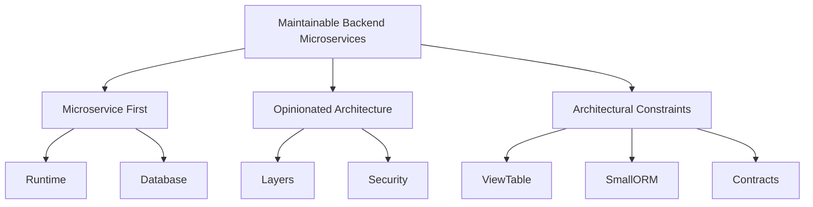

Every major architectural decision inside GEMVC originates from a single question:

> **If a framework existed exclusively for backend microservices, what architecture would naturally emerge?**

Everything else follows from that answer.

---

# Architectural Principles

---

# Principle 1 — Microservice First

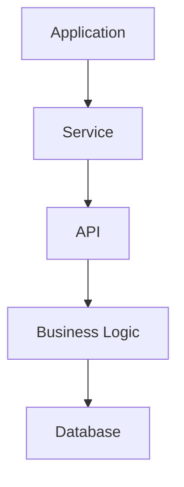

Every GEMVC application is assumed to be an independent backend microservice.

The framework intentionally does **not** optimize for:

- Monolithic applications
- Full-stack frameworks
- Template rendering
- CMS platforms
- Traditional MVC websites

This assumption simplifies the entire architecture.

---

# Principle 2 — One Service Owns One Database

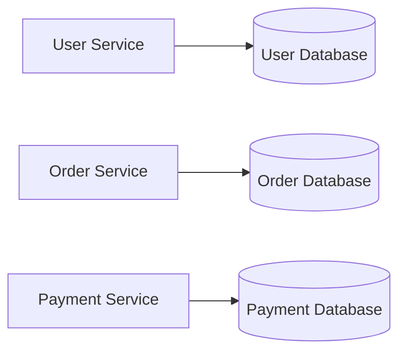

Each service owns exactly one database.

This is an architectural assumption.

Not a technical limitation.

This principle provides:

- Clear ownership
- Simpler runtime
- Simpler connection management
- Predictable migrations
- Independent deployment
- Strong service boundaries

---

# Principle 3 — Public Service Contracts

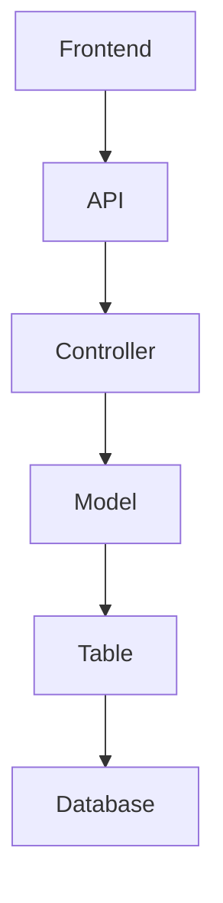

Frontend applications communicate only with Services.

Controllers, Models and Tables are internal implementation details.

The API layer defines the public service contract.

Everything behind the API layer may evolve independently.

This separation protects clients from internal refactoring.

---

# Principle 4 — Clear Layer Responsibilities

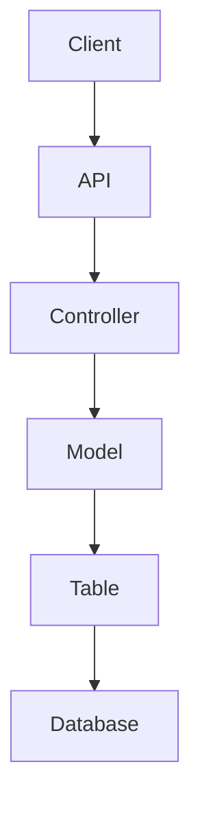

| Layer | Responsibility |
|---------|----------------|
| API | Public Service Contract |
| Controller | Use Case Orchestration |
| Model | Business Logic |
| Table | Persistence |

Each layer has exactly one responsibility.

Responsibilities never overlap.

---

# Principle 5 — Runtime Independence

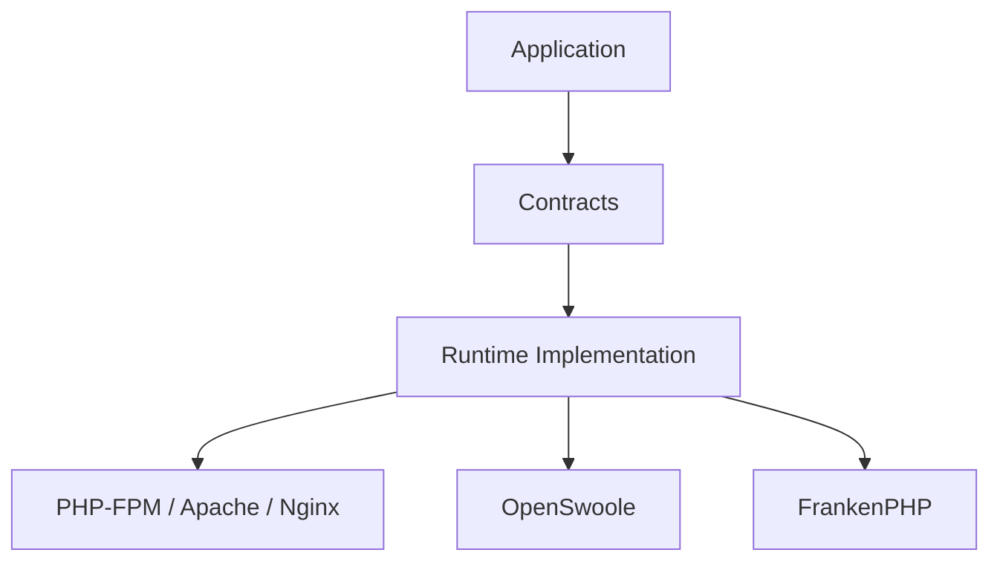

Business code never depends on runtime implementations.

Application code depends only on contracts.

Runtime packages implement those contracts.

Changing the runtime should not require application changes.

FrankenPHP: classic mode by default (`StandardHttpRequest` + `Bootstrap` + PDO); worker mode is opt-in. Edge path security lives in the **Caddyfile** (not `.htaccess`). See [docs/guides/frankenphp.md](docs/guides/frankenphp.md).

---

# Principle 6 — Security by Principle

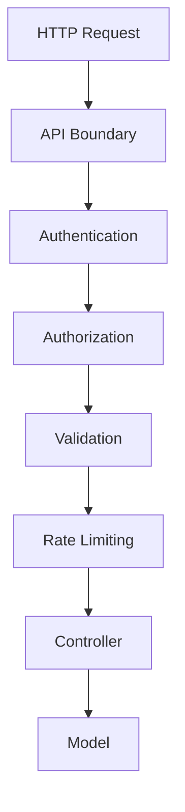

Security belongs at the service boundary.

Whenever possible:

- Authentication
- Authorization
- Validation
- Rate Limiting

should execute before business logic.

Secure behaviour should be the default (`ProtectedApiService` / `requireAuth()`, schema validation, rate-limit drivers).

---

# Principle 7 — Explicit Architecture

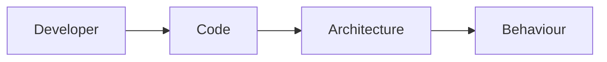

Hidden behaviour increases complexity.

GEMVC intentionally favors explicit architecture over excessive framework magic.

Developers should understand application behaviour by reading the source code.

---

# Principle 8 — Small Focused Components

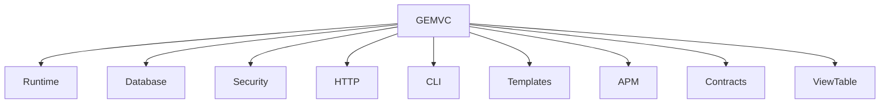

Every component solves one problem.

Large abstractions are replaced with focused packages.

Examples include:

- Connection Contracts
- Runtime Implementations
- HTTP Client
- APM
- CLI
- CRUD Generator
- Templates

---

# Runtime Architecture

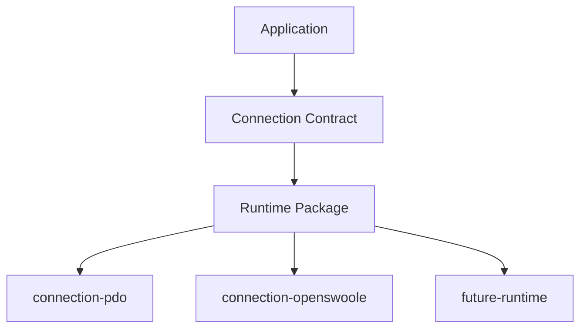

The runtime decides **how** connections are managed.

The application never does.

PHP-FPM may use a single reusable PDO connection.

OpenSwoole may use a real coroutine-aware connection pool.

Application code remains identical.

---

# Connection Philosophy

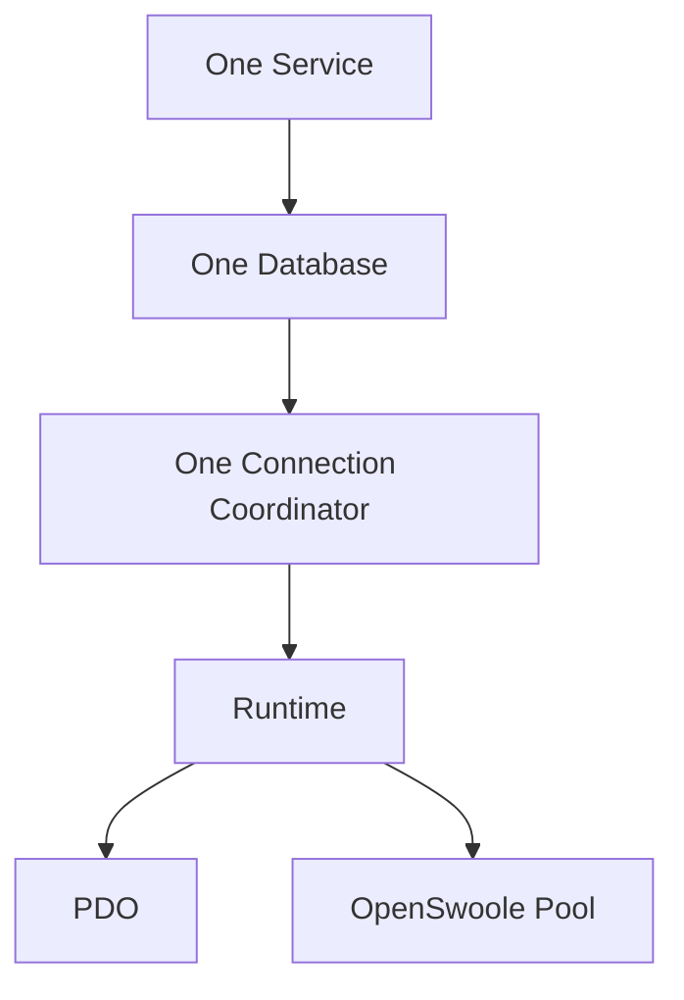

Connection management follows architectural assumptions.

The framework creates one connection coordinator per application.

The runtime implementation decides whether that coordinator manages:

- a single reusable connection
- or a connection pool

This design keeps application code independent from infrastructure.

---

# Design Constraints

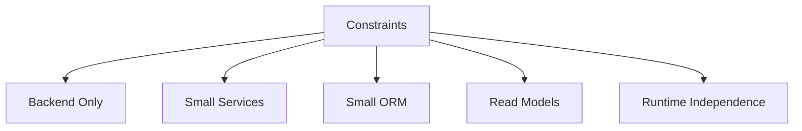

GEMVC intentionally accepts constraints.

These constraints reduce complexity.

## Backend Only

The framework does not include frontend rendering.

## Small Services

Large services should be divided into smaller services.

## Small ORM

Persistence should remain simple.

The ORM exists to map data.

Not to become a complete object graph framework.

## Read Models

Database Views belong to ViewTable.

Read operations and write operations are intentionally separated.

---

# Architectural Cause and Effect

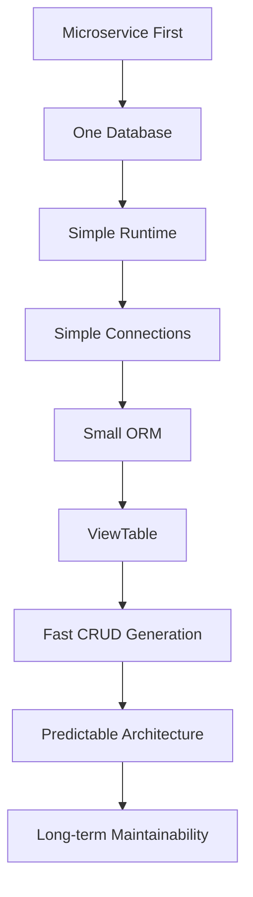

This diagram summarizes the philosophy of GEMVC.

Most architectural decisions are not independent features.

They are consequences of earlier architectural assumptions.

---

# Architecture Before Features

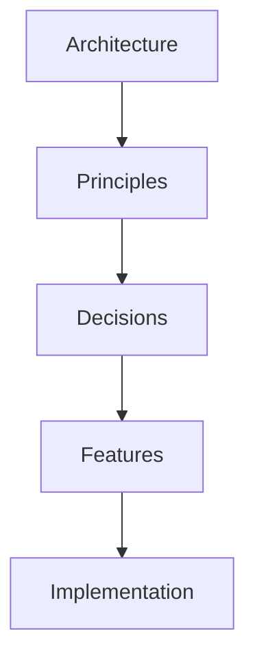

Features do not define GEMVC.

Architecture defines GEMVC.

Features may evolve.

Architectural principles should remain stable.

Before introducing any new feature, one question should always be asked:

> **Does this strengthen the architectural philosophy of GEMVC?**

If the answer is no, the feature should be reconsidered.

---

# Conclusion

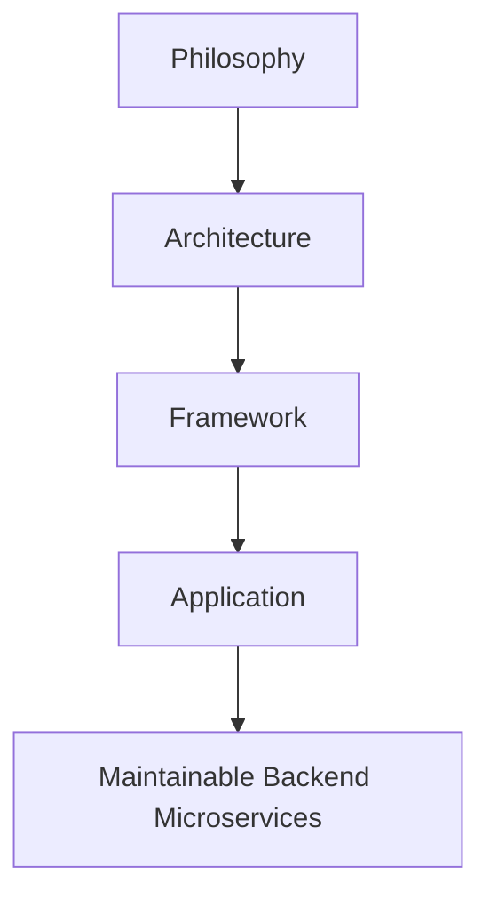

GEMVC is not a general-purpose PHP framework.

It is an opinionated architecture for backend microservices.

Every major design decision—including the four-layer architecture, runtime abstraction, contracts, connection management, ViewTable, the lightweight ORM, and Security by Principle—originates from a single architectural philosophy.

Understanding these architectural assumptions is more important than understanding any individual feature.

Everything else in the framework is simply a consequence of them.
